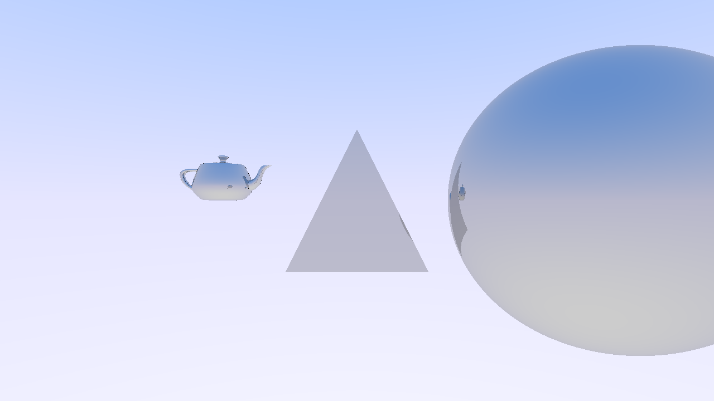

# Vulkan GPU Raytracer • tracey_rt



# Build / Setup Process
Instructions in [BUILD_INSTRUCTIONS.md](BUILD_INSTRUCTIONS.md)

# Usage

```
~/Developer/tracey_rt ❯ ./bin/tracey_rt --help
Usage: tracey_rt <arguments>
 * using no arguments runs tracey_rt in interactive mode
--input, -i                      <filename> set the input scene
--dim, --dimension, -d, --size   <width> <height> set the image dimension
--output, -o                     <filename> set the ResultImageName for the output
--samples, -s                    <samples> set the image samples
--non-interactive                Run tracey_rt in non-interactive mode explicitly
--help, -h                       Display this text
--version                        Display the version
```